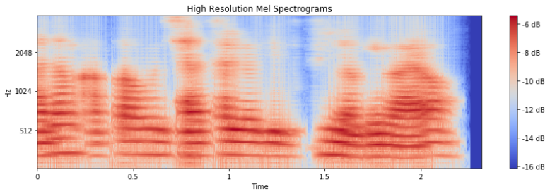

# 1. preprocessing-of-speech
VAD + Resampling


## VAD (*Voice Activity Detection*)
Although the words are short, there is a lot of silence in them. A decent VAD can reduce training size a lot, accelerating training speed significantly. Let's cut a bit of the file from the beginning and from the end. 


## Resampling
Frequently related frequencies of speech exist in the lower bands (~8000Hz)


## VAD + Resampling


## Usage
1. pip install -r requirements.txt
2. Move `main.py` to where the `.wav` files are located.
3. **Run** `main.py`
4. The folder will be created and the files will be downloaded to that folder.

## Arguments

```
python3 main.py [--opt OPT] [--path PATH]
```
```
Preprocessing of Speech

optional arguments:
 --opt OPT    preprecessing mode : vad=1, resampling=2, vad+resampling=3 (default: 3)
 --path PATH  wav file location (default: current directory)
```


# 2. High resolution spectrogram
Code that runs FFTs of several window sizes, aligns their centers, and then applies mel weighting to combine them.

With single FFTs, short windows have good time resolution but lack frequency breadth (no lower frequencies), whereas long windows have good frequency breadth but lack time precision (windows contain many wavelengths at higher frequencies). Here we combine FFTs of varying window length to tackle this.


---------------------------
***- The extracted feature is of much higher resolution, so it's expected to have a lot of information and actually helps to solve the confusion matrix problem for similar sounds.***
---------------------------
```
python3 high_resolution_mel_spectrogram.py [--path PATH]
```
```
Preprocessing of Speech

optional arguments:
 --path PATH  preprocessed(VAD/resampling) wav file location (default: current directory)
```


###### \*All images were represented in the same voice file.
